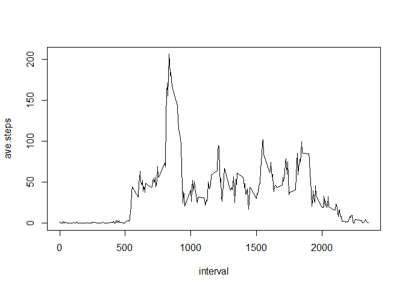
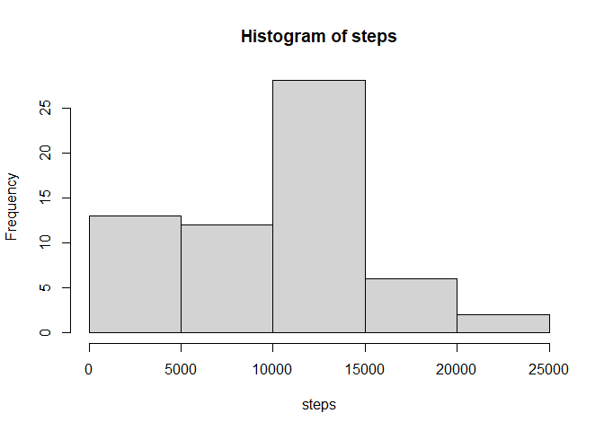
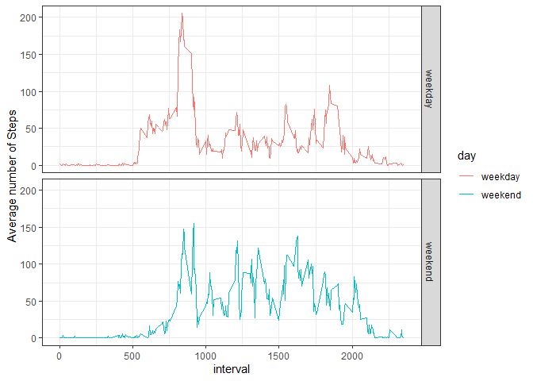

## Loading and preprocessing the data
* Load the data 
* Reformat the `date` variable to the date class


```r
data <- read.table(unz("activity.zip", "activity.csv"), header=T, sep=",")
data$date <- as.Date(data$date, format = "%Y-%m-%d")
```


## What is mean total number of steps taken per day?
* Calculate the total number of steps taken per day
* Make a histogram of the total number of steps taken each day
* Calculate and report the mean and median of the total number of steps taken per day


```r
totals <- aggregate(data$steps, list(data$date), FUN=sum)
names(totals) <- c("date", "steps")

with(totals, hist(steps))
```

<!-- -->

```r
m1 <- mean(totals$steps, na.rm = T)
m2 <- median(totals$steps, na.rm = T)
```

The mean total number of steps taken per day is 1.0766189\times 10^{4}. The median total number of steps taken per day is 10765.


## What is the average daily activity pattern?
* Make a time series plot of the 5-minute interval and the average number of steps taken, averaged across all days 
* Which 5-minute interval, on average across all the days in the dataset, contains the maximum number of steps?


```r
intervals <- aggregate(data$steps, list(data$interval), FUN=mean, na.rm = T)
names(intervals) <- c("interval", "ave.steps")

with(intervals, plot(interval, ave.steps, type = "l"))
```

<!-- -->

```r
int <- intervals$interval[which.max(intervals$ave.steps)]  
```
The 5-minute interval with the highest average number of steps is the interval starting at 835 hours.


## Imputing missing values
* Calculate and report the total number of missing values in the dataset (i.e. the total number of rows with NAs)
* Devise a strategy for filling in all of the missing values in the dataset and create a new dataset that is equal to the original dataset but with the missing data filled in.
* Make a histogram of the total number of steps taken each day and Calculate and report the mean and median total number of steps taken per day. Do these values differ from the estimates from the first part of the assignment? What is the impact of imputing missing data on the estimates of the total daily number of steps?

```r
miss <- sum(!complete.cases(data))

data_im <- data
for (i in 1:nrow(data_im)){
        if (is.na(data_im$steps[i])){
                data_im$steps[i] <- median(data_im$steps[data_im$interval == data_im$interval[i]],
                                           na.rm = T)
        }
}

totals_im <- aggregate(data_im$steps, list(data_im$date), FUN=sum)
names(totals_im) <- c("date", "steps")

with(totals_im, hist(steps))
```

<!-- -->

```r
m1_im <- mean(totals_im$steps)
m2_im <- median(totals_im$steps)
```
There are 2304 rows with missing values in the data set. Missing values were replaced with the median (across all days) of the corresponding time interval. With the imputed values, the mean total number of steps taken per day is 9503.8688525, and the median total number of steps taken per day is 1.0395\times 10^{4}. Many time periods had a median of 0 steps, so we see that the histogram, mean, and median are pulled more toward zero.


## Are there differences in activity patterns between weekdays and weekends?
* Create a new factor variable in the dataset with two levels – “weekday” and “weekend” indicating whether a given date is a weekday or weekend day.
* Make a panel plot containing a time series plot of the 5-minute interval (x-axis) and the average number of steps taken, averaged across all weekday days or weekend days (y-axis).

```r
days <- c("Monday", "Tuesday", "Wednesday", "Thursday", "Friday")
ends <- c("Saturday", "Sunday")

data_im$day[weekdays(data_im$date) %in% days] <- "weekday"
data_im$day[weekdays(data_im$date) %in% ends] <- "weekend"


data_im$day <- as.factor(data_im$day)

data_im_days_ave <- aggregate(data_im$steps, list(data_im$day, data_im$interval), FUN = mean)
names(data_im_days_ave) <- c("day", "interval", "ave.steps")

library(ggplot2)
ggplot(data = data_im_days_ave, aes(x = interval, y = ave.steps, color = day)) + 
        geom_line() + 
        facet_grid(day ~ .) + 
        ylab("Average number of Steps") + 
        theme_bw()
```

<!-- -->
